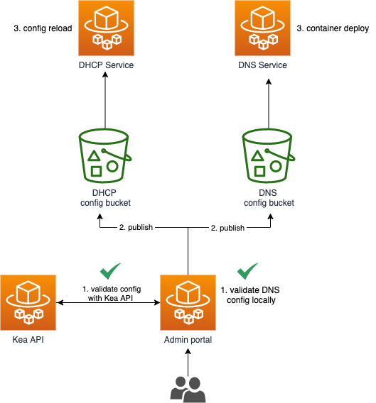

# Disaster Recovery

Unplanned downtime needs to be addressed as soon as possible to minimise disruption of end user devices.

Below is a list of potential causes, how these errors will be raised as alarms and how to remediate them:

1. [Corrupt configuration file was published](#corrupt-configuration-file)
2. [Corrupt container was published](#corrupt-container-was-published)
3. [Missconfigured infrastructure](bad-infrastructure-apply-with-terraform)
4. [DHCP Subnet gets full](#dhcp-subnet-gets-full)
5. [Service is receiving more traffic than it can handle](#server-is-receiving-more-traffic-than-it-can-handle)
6. [AWS Availability Zone goes down](#aws-availability-zone-goes-down)
7. [Other AWS failures](#other-aws-failures)

## Corrupt configuration file

The [self service portal](https://github.com/ministryofjustice/staff-device-dns-dhcp-admin) allows administrators to make changes to the DNS and DHCP services in production. DHCP will have more configuration update requirements than DNS due to the need to manage subnets.

[DHCP server won't reload corrupt config file]
[DNS server launch new instances to take over]
[Investigate audit trail in the admin]

Measures have been taken to validate the changes, using service specific tools.
This should prevent any corrupt configurations from being published.

[Image Source](./diagrams/config-validation.drawio)

[diagram]

#### DHCP 

The Kea API [config-test](https://kea.readthedocs.io/en/kea-1.6.2/api.html#ref-config-test) command is used to validate the configuration file.

#### DNS

Bind verifies the configuration using the [named-checkconf](https://bind9.readthedocs.io/en/v9_16_8/configuration.html) command.

While these tools have proven to be reliable, if any configuration error was to get through, it could lead to the new instance of the server failing to boot.

Grafana alarms are configured to go off in this situation.
The specific metrics that are being monitored to make this visible are:

1. Unhealthy host count
2. Running task count

Either of these alarms going off could indicate a bad configuration file was published.

To recover from this situation, a utitlity scripts exists that can be run to roll back to a perviously known good version. Please see [Staff Device DNS DHCP Disaster Recovery](https://github.com/ministryofjustice/staff-device-dns-dhcp-disaster-recovery)

## Corrupt container was published

If a bug was introduced into either the DNS or DHCP containerised servers, it could cause downtime.

We run automated tests in the build pipeline which will prevent a container from being pushed to AWS ECR if the tests failed. 

Grafana alarms are configured to go off in this situation.
The specific metrics that are being monitored to make this visible are:

Unhealthy host count

Remediation will take place by using Git to check out a previously known good version.
A good version can be identified by correlating metrics and ...
This will need to be commited to the main branch and pushed through the pipeline.

[Add ECR rollback to DR scripts]

## Missconfigured infrastructure 

All infrastructure is managed by Terraform. Any updates are pushed through the build pipelines and applied to all environments. One of the first courses of action should be to re-run the pipeline to ensure the infrastructure in AWS matches what's in the code. Any manual changes made in AWS will be restored to what's defined in Terraform.

It is not possible to prevent applying syntactically correct, but missconfigured infrastructure.

Rolling back should be done with Git and pushed through the pipeline.

[What are the steps here]

## Subnet gets full

This is only related to DHCP, but in the event of a subnet filling up, the subnet will need to be increased.

[increase subnet]

## Service is receiving more traffic than it can handle

[Perf testing results]

Alarms are configured to go off when resources required go above 70% for CPU and Memory.
This type of failure can be detected early before the system reaches maximum capacity.

## AZ goes down and other AWS Failures

Both DNS and DHCP are designed to run in multiple availability zones. One going down will result in the other taking over.

## Other AWS failures

Identify the failure on the [AWS status](https://status.aws.amazon.com/) page.
Get in contact with AWS as soon as possible
